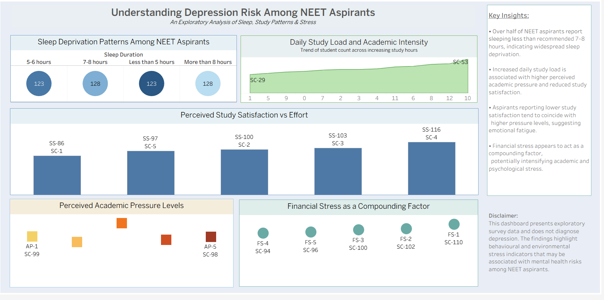

# Understanding Depression Risk Among NEET Aspirants

## Project Overview
This project presents an exploratory data analysis of behavioural and environmental factors that may be associated with depression risk among NEET aspirants. The analysis focuses on sleep patterns, study intensity, perceived academic pressure, study satisfaction, and financial stress.

The goal of this project is to demonstrate data analysis, SQL-based exploratory workflows, and effective data storytelling through interactive visualisation.

> ⚠️ **Note:** This project uses **synthetic (simulated) survey data** created for analytical and visualisation purposes only. It does not diagnose mental health conditions.

---

## Tools & Technologies
- **SQL** – Data cleaning and exploratory data analysis  
- **Tableau** – Interactive dashboard and visual storytelling  
- **Gemma-AI** - For report generation and beautification 
---

## Dataset
- Synthetic survey dataset designed to reflect realistic NEET preparation scenarios
- Created to avoid privacy and ethical concerns associated with sensitive mental health data

---

## Key Insights
- A significant proportion of aspirants report sleeping less than the recommended 7–8 hours.
- Increased daily study load is associated with higher perceived academic pressure.
- Study satisfaction does not consistently increase with effort, indicating potential emotional fatigue.
- Financial stress appears to act as a compounding factor alongside academic pressure.

---

## Dashboard Preview

---

## Disclaimer
This analysis is exploratory and illustrative in nature. The findings highlight patterns that may be associated with mental health risks but do not diagnose depression or other mental health conditions.

---

## Author
Devanshu Garad  

